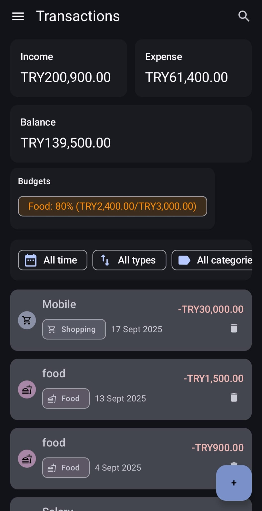
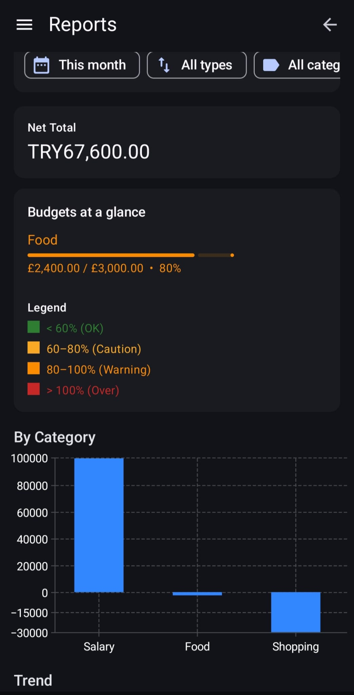
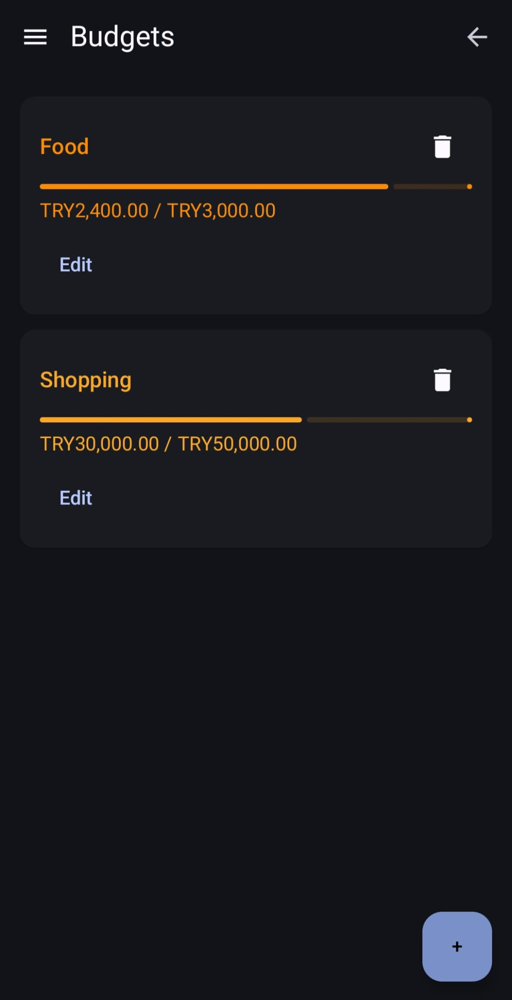
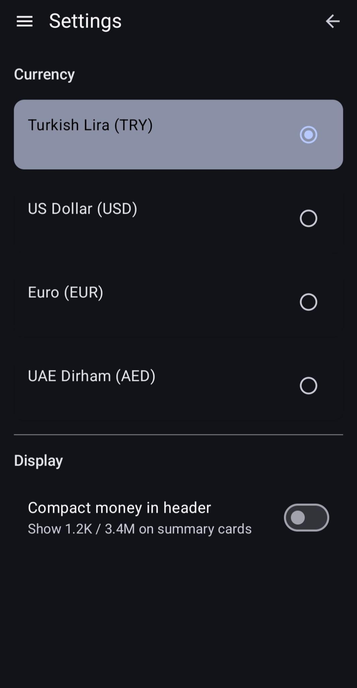
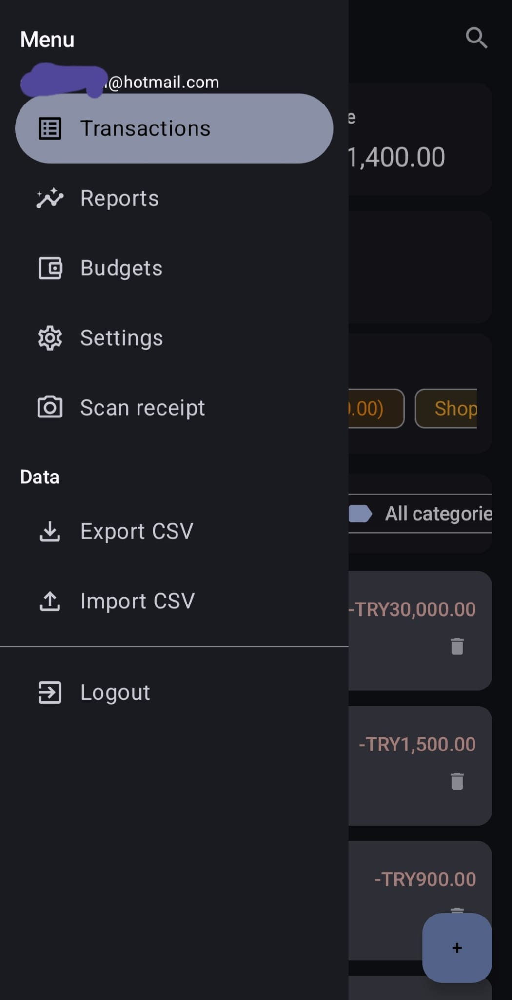

# FinanceApp

FinanceApp is a modern Android application for **personal finance management**.  
It allows you to track income and expenses, manage budgets, generate reports, switch between currencies, and even scan receipts.  
The project is built using **Clean Architecture + MVVM** with modular design.  

⚠️ **Disclaimer:** This project is created for **educational and portfolio purposes only**.  
Not licensed for commercial use.  

---

## Features

- **Transactions:** Add, edit, and delete income or expense entries  
- **Budgets:** Set category-based budgets with live progress tracking  
- **Reports:** Visualize expenses and income trends with charts  
- **Settings:** Multi-currency support (TRY, USD, EUR, AED) + compact money formatting  
- **Receipt Scanning:** Capture and store receipts (placeholder demo)  
- **Data Management:** Export and import CSV  
- **Authentication:** Simple login and logout with navigation drawer  

---

## Screenshots

### Transactions
Track income, expenses, balance, and budgets.

| Transactions | Reports |
|--------------|---------|
|  |  |

### Budgets & Settings
Manage budgets and configure currency preferences.

| Budgets | Settings |
|---------|----------|
|  |  |

### Scan & Menu
Scan receipts and access the navigation drawer.

| Scan Receipt | Menu |
|--------------|------|
|  |  |

---

## Tech Stack

- **Language:** Kotlin  
- **Architecture:** Clean Architecture + MVVM  
- **UI:** Jetpack Compose / XML + Material Components  
- **Local Data:** Room Database (DAO pattern)  
- **Preferences:** Jetpack DataStore (currency + settings)  
- **Dependency Injection:** Hilt (AppModule)  
- **Async:** Kotlin Coroutines & Flow  

---

## Project Structure

```text
com.example.financeapp
│
├─ core.prefs
│  ├─ CurrencyPrefs.kt
│  └─ DataStoreExt.kt
│
├─ di
│  └─ AppModule
│
├─ feature_auth
│  ├─ data
│  ├─ domain
│  └─ presentation
│
├─ feature_settings
│
├─ feature_transaction
│  ├─ data
│  │  ├─ local
│  │  ├─ remote
│  │  └─ repository
│  ├─ domain
│  │  ├─ model
│  │  ├─ recurring
│  │  ├─ repository
│  │  └─ use_case
│  │     ├─ budget
│  │     ├─ recurring
│  │     └─ transaction
│  └─ presentation
│     ├─ add_edit
│     ├─ budgets
│     ├─ recurring
│     ├─ reports
│     ├─ scan
│     └─ transaction_list
│
├─ ui
├─ FinanceApp
├─ MainActivity
```

## Getting Started

### Prerequisites

-   Android Studio Hedgehog or newer
    
-   JDK 17
    
-   Android 8.0+ device or emulator

### Setup

1.  Clone the repo
git clone https://github.com/AnasAlhatti/Financeapp.git
cd FinanceApp
2. Open in **Android Studio** and let Gradle sync
3. Run on an emulator or physical device

## How It Works

-   **Domain Layer:** Contains models, repositories, and use cases (budget, recurring, transaction).
    
-   **Data Layer:** Handles persistence with Room and preferences with DataStore.
    
-   **Presentation Layer:** ViewModels and UI for transactions, budgets, reports, scan, and settings.
    
-   **DI:** `AppModule` provides dependencies using Hilt.
    
## Roadmap

-   Receipt OCR integration
    
-   Advanced analytics with interactive charts
    
-   Cloud sync (Firebase)
    
-   Multi-language support

## Educational Disclaimer

This project is for **learning and portfolio purposes only**.  
Not licensed for commercial use.
